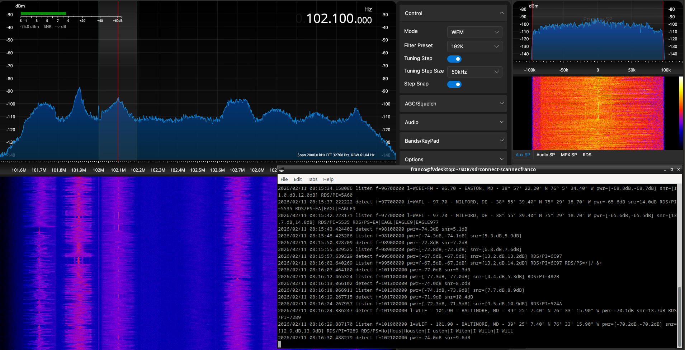

# SDRconnect scanner utility

`sdrconnect-scanner` is a command line utility to run SDRconnect as a scanner.





*IMPORTANT* `sdrconnect-scanner` requires SDRconnect 1.0.7 or newer

The utility can scan a range of evenly spaced frequencies, or an arbitrary list of frequencies. 
The first use case is typically used when one wants to monitor all the channels in a given band (for instance all the 200kHz spaced channels in the FM-BC band).
The second scenario is when one wants to monitor only specific frequencies for traffic (for instance the local repeaters in the 2m band).

`sdrconnect-scanner` can be configured to scan multiple ranges (and/or lists) of frequencies one after the other with different settings, for instance using different SDRconnect profiles or squelch levels.

The scanner works this way: for each frequency it first listens briefly to it to detect if there's any signal based on signal power and/or signal SNR; if it does detect a signal, it will stop at that frequency for some time allowing the user to listen to that station. It will then move to the next frequency.

While it is running, `sdrconnect-scanner` can be controlled by the user with these keys:
  - space pauses the scanner at the current frequency allowing to listen to it for longer; another space resumes scanning
  - 'q' or Ctrl-C terminates the scanner
  - 'n' makes the scanner move to the next configured `[scan]` section
  

## Internals

`sdrconnect-scanner` leverages SDRconnect WebSockets to fully control SDRconnect by using the SDRconnect WebSocket API (see references).


## Build instructions

Linux x86-64:
```
make linux-amd64
```

Linux ARM 64:
```
make linux-arm64
```

Windows x86-64:
```
make windows-amd64
```

MacOS ARM 64:
```
make darwin-arm64
```


## Command line arguments

These are the command line arguments for `sdrconnect-scanner`:

    -ws <SDRconnect web soacket address> (default: 127.0.0.1:5454)
    -conf <configuration file>
    -labels <CSV file with labels>
    -debug enable debug logging (default: disabled)


## Configuration file(s)

Most of the configuration for `sdrconnect-scanner` is done via a configuration file.

### Configuration file format

The configuration file is in .ini (or TOML) format.
Comments begin with '#'. Comments and empty lines are ignored.
This is an example of a simple configuration file:
```
detect power threshold = -70
detect snr threshold = 5
detect time = 600
listen time = 5000

# FM scan
[scan]
range = 87.9e6, 107.9e6, 200e3
profile = FM-2Msps
#demodulator = WFM
#lo offset = 10e3
squelch = -100

# NOAA scan
[scan]
range = 162.400e6, 162.550e6, 25e3
profile = NFM-250ksps
#demodulator = NFM
#lo offset = 10e3
```

More examples are in the [examples](examples) directory.

Settings can be specified within a '[scan]' section or in the default section at the beginning of the file. Settings in a '[scan]' section override default values.

### Configuration file settings:

- `detect power threshold`: power threshold in dB for a signal to be detected in a frequency being scanned (think S-meter level)
- `detect snr threshold`: SNR threshold in dB for a signal to be detected in a frequency being scanned
- `detect time`: time (in ms) the scanner listens to a frequency in order to detect if a signal is present (should be >= 600ms)
- `listen time`: time (in ms) the scanner stays on a frequency once a signal is detected (default: 500ms = 5s)
- `range`: comma separated triple with start frequency, stop frequency, and frequency step (step can be positive or negative to scan up or down)
- `list`: comma separated list of frequencies to be scanned
- `profile`: name of SDRconnect profile to be applied - this is easiest way to run `sdrconnect-scanner`
- `device name`: SDRconnect display name to be selected
- `device serial`: RSP serial number to be selected
- `sample rate`: hardware sample rate
- `demodulator`: demodulator mode (one of: AM, USB, LSB, CW, SAM, NFM, WFM)
- `lna state`: LNA state; controls RF gain reduction
- `agc`: AGC threshold
- `squelch`: squelch threshold in dB
- `lo offset`: offset to the LO frequency to avoid a scanned frequency to be exactly on a LO frequency


## Labels file

A labels file is a two column CSV file in RFC-4180 format.

The first column has the frequency or the 4-character RDS PI code, and the second column has the label associated with it.
Comments begin with '#'. Comments and empty lines are ignored.
The file [examples/labels.csv](examples/labels.csv) shows an example of a labels CSV file.
The Python script `generate_rds_pi_labels.py` can be used to extract the labels from the NRSC RDS PI Code Allocations web page.


## How to run

The recommended way to setup and run `sdrconnect-scanner` is to first create one or more profiles in SDRconnect with the desired settings for RSP device, sample rate, demodulator, antenna, gains, filters, etc.
Then in the confguration file simply reference the desired profile in each of the `[scan]` sections. If the SDRconnect profile to be used is the same for all the scans, it is probably easier to just put it in the default section at the beginning.

After that, `sdrconnect-scanner` can be run as follows:
```
sdrconnect-scanner -conf scan.conf -labels labels.csv
```


## References

  - SDRconnect WebSocket API: https://www.sdrplay.com/docs/SDRconnect_WebSocket_API.pdf
  - RFC-4180: https://www.rfc-editor.org/rfc/rfc4180.html


## Copyright

(C) 2026 Franco Venturi - Licensed under the GNU GPL V3 (see [LICENSE](LICENSE))
